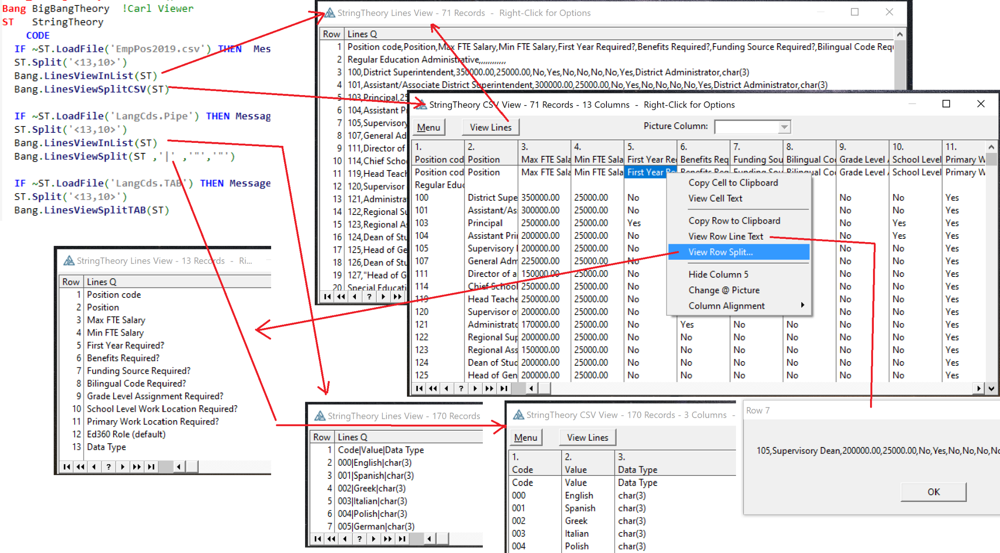

# StringTheory-LoadFile-Viewer
 StringTheory LoadFile Viewer aka BigBangTheory

StringTheory makes it easy to load a CSV file and split it into columns. This class helps by allowing you to view the file right from the StringTheory object to be sure you have the data you think uou do, and to see how the splits are working.

You write code like below (from https://www.capesoft.com/docs/StringTheory3/StringTheory.htm#ParsingCSVFile).
```Clarion
str   StringTheory
lne   StringTheory
x     Long
  code
  str.LoadFile('Somefile.CSV')
  str.Split('<13,10>','"')
  loop x = 1 to str.Records()
    Lne.SetValue(Str.GetLine(x))
    Lne.Split(',','"','"',true)
    field1 = Lne.GetLine(1)
    field2 = Lne.GetLine(2)
  End
```

Insert BigBang to see the results.

```Clarion
str   StringTheory
lne   StringTheory
x     Long
Bang BigBangTheory    !<-- Viewer
  code
  str.LoadFile('Somefile.CSV')
  str.Split('<13,10>','"')
  IF DebugLoad THEN               !<-- Add
     Bang.LinesViewInList(str)    !<-- Add
     Bang.LinesViewSplitCSV(Str)  !<-- Add
     Bang.LinesViewSplit(Str,',','"','"')  !Alternate 
  END
  loop x = 1 to str.Records()
    Lne.SetValue(Str.GetLine(x))
    Lne.Split(',','"','"',true)
    field1 = Lne.GetLine(1)
    field2 = Lne.GetLine(2)
  End
```

Screen capture shows the views available. 



I would expect you might use this class in your APP to allow viewing files before import. You probably will want to remove a lot of the features.

There is also a SystemStringClass version. That class has no ability to deal with CSV type quoted values.
