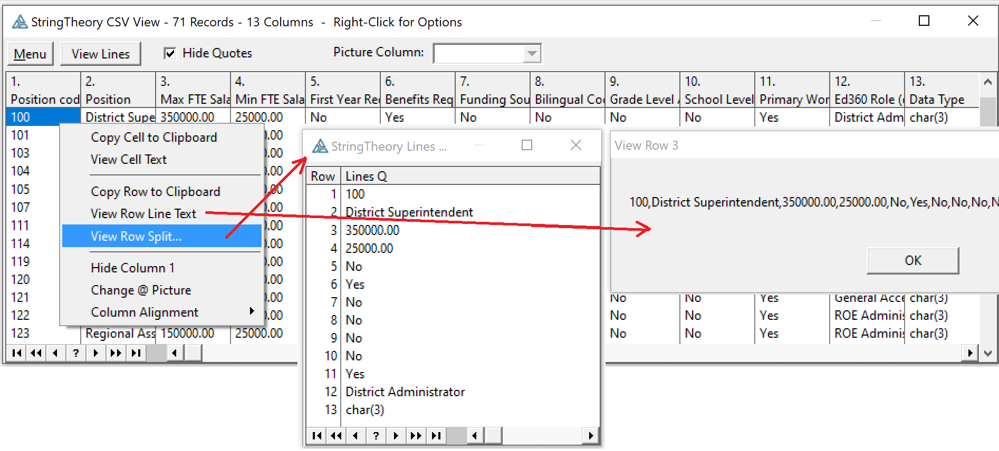
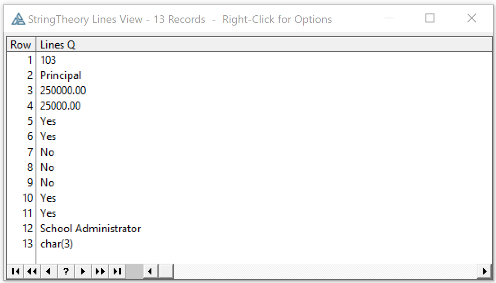
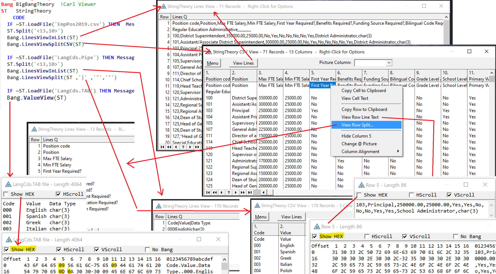
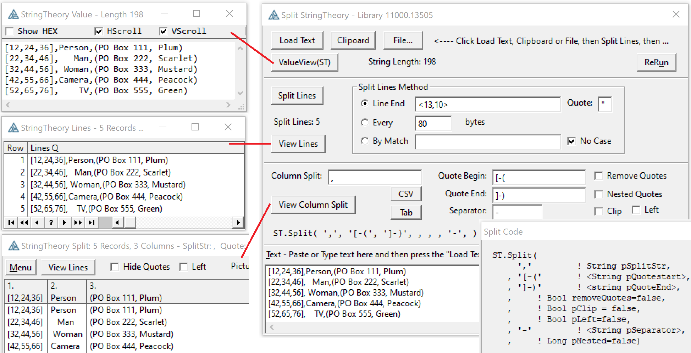
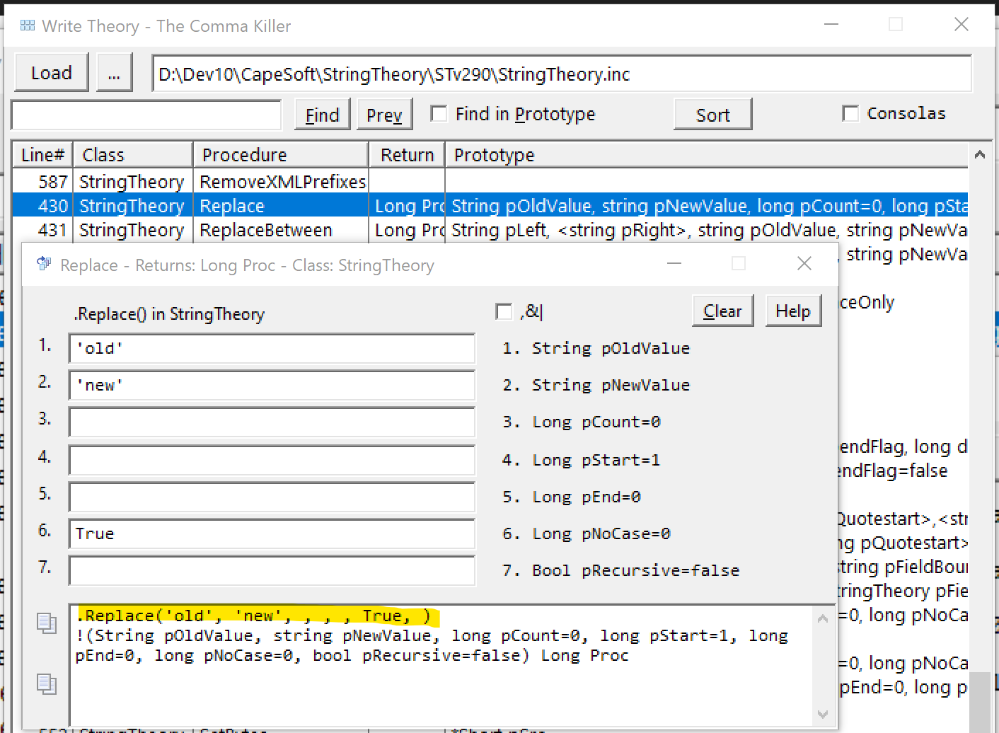
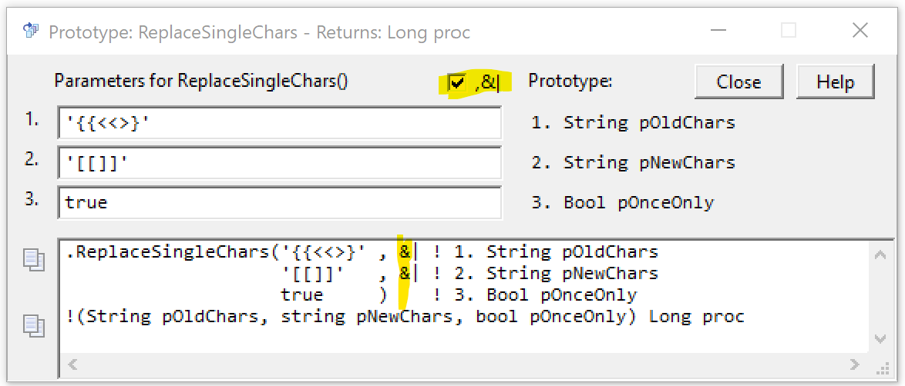
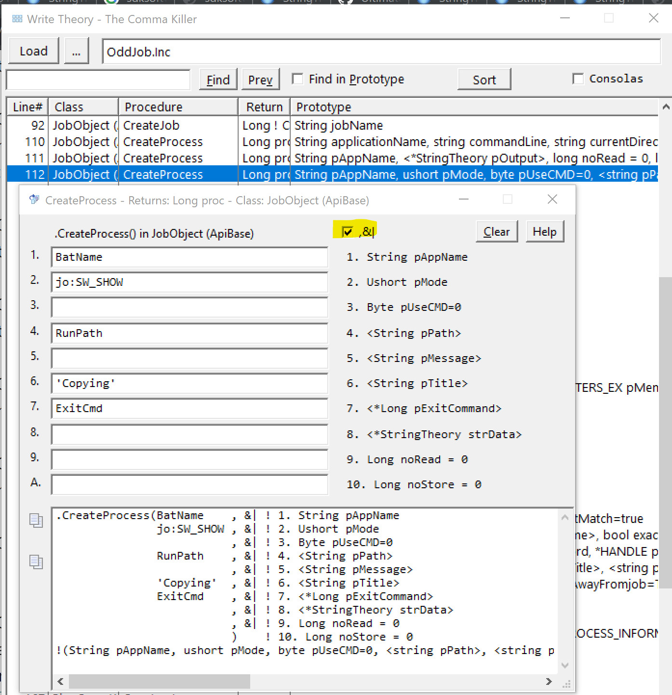

# StringTheory-Tools

This repository contains 2 tools to make it easier to write and verify code using the StringTheory class from http://CapeSoft.com

[BigBangTheory Class](#BigBangTheory-Value-and-Split-Lines-Viewer) - Debug/ trace ST code by viewing ST Value or Lines in a Window
[Scratch Theory](#Scratch-Theory) - A scratch program to write and test ST code in a small program before pasting into your production code
[Split Theory](#Split-Theory) - Try 
[Split Theory](#Split-Theory) - A 
[Split Theory](#Split-Theory) - A 
 
## BigBangTheory Value and Split Lines Viewer

What's in the StringTheory .GetValue() string or Lines queue? With 1 line of code BigBangTheory will show you in a popup Window.

To help you see what your StringTheory code is actually doing the Big Bang class allows
 you to view the current GetValue() string or Split() Lines queue in a Window. This allows
 scrolling the data and digging deeper which can be easier than looking at Debug View or Message boxes.
 A Lines "Split Viewer" allows you to specify your Split( parameters ) and see the resulting columns in a List.

New 2/4/21 added SliceView() and SubView() that were used in [Find Clean CW IDE](https://github.com/CarlTBarnes/FindCleanCwIDE)

```Clarion
BigBangTheory  CLASS,TYPE,MODULE('BigBangTheory.CLW'),LINK('BigBangTheory.CLW')
DoNotShow         BOOL  !=True doesn't show any BBT Windows, Class is for Developers

ValueView         PROCEDURE(StringTheory STtoViewGetValue, <STRING WindowCaption>)
SliceView         PROCEDURE(StringTheory STtoViewSlice, Long SliceStart=1, Long SliceEnd=0, <STRING CapTxt>) 
SubView           PROCEDURE(StringTheory STtoViewSub  , Long SubStart=1,  Long SubLength=1, <STRING CapTxt>) 

StringView        PROCEDURE(STRING  StrValue, <STRING WindowCaption>) 

WrapView          PROCEDURE(StringTheory STforWrap, <STRING WindowCaption>, Bool pOpenWrapped=false)

LinesViewInList   PROCEDURE(StringTheory STwithLinesSplitDone, <STRING WindowCaption>)

LinesViewSplitCSV PROCEDURE(StringTheory STwithLinesSplitDone, BYTE RemoveQuotes=False)  
LinesViewSplitTAB PROCEDURE(StringTheory STwithLinesSplitDone)  
LinesViewSplit    PROCEDURE(StringTheory STwithLinesSplitDone, STRING SplitDelim, <STRING QuoteStart>,<STRING QuoteEnd>, BYTE RemoveQuotes=TRUE)  
```

StringTheory makes it easy to load a CSV file and split it into columns
 with code like below (from https://www.capesoft.com/docs/StringTheory3/StringTheory.htm#ParsingCSVFile).
```Clarion
str   StringTheory
lne   StringTheory
x     Long
  code
  str.LoadFile('Somefile.CSV')
  str.Split('<13,10>','"')
  loop x = 1 to str.Records()
    Lne.SetValue(Str.GetLine(x))
    Lne.Split(',','"','"',true)
    field1 = Lne.GetLine(1)
    field2 = Lne.GetLine(2)
  End
```

Insert BigBang calls to view the LoadFile String Value or the results of Splits in a LIST.

```Clarion
str   StringTheory
lne   StringTheory
x     Long
Bang BigBangTheory    !<-- Viewer
  code
  str.LoadFile('Somefile.CSV')
  str.Split('<13,10>','"')
     Bang.DoNotShow=CHOOSE(~DebugLoad) !<-- Limit to just developers
     Bang.ValueView(str)          !<-- See GetValue() String in TEXT
     Bang.LinesViewInList(str)    !<-- See Lines Queue from Split(13,10)
     Bang.LinesViewSplitCSV(Str)  !<-- See Lines Split as CSV columns
     Bang.LinesViewSplit(Str,',','"')  !Alternate specify Split( parms )

  Loop x = 1 to str.Records()
    Lne.SetValue(Str.GetLine(x))
    Lne.Split(',','"','"',true)
    IF X=5 AND DebugLoad THEN     !<-- Limit to developers and line 5
       Bang.LinesViewInList(Lne)  !<-- See Lines: Lne.Split(',','"','"',true)
    END
```

Call ```Bang.LinesViewInList(str)``` to view a LIST with the result of the ```ST.Split('<13,10>','"')``` to lines:


Typical code loops the 13,10 split lines to split each line using CSV or Tabs.
You can see the entire file split this way in a LIST with a calling ```Bang.LinesViewSplit(Str,',','"')``` or for CSV call ```Bang.LinesViewSplitCSV(Str)```.


In that list you can right click on a row and view the columns as rows in a LIST. You can also see then entire line or copy it to the clipboard.




```Clarion
  loop x = 1 to str.Records()
    Lne.SetValue(Str.GetLine(x))
    Lne.Split(',','"',,true)
    IF X=5 AND DebugLoad THEN     !<-- Limit to developers and line 5
       Bang.LinesViewInList(Lne)  !<-- See Lines from your: Lne.Split(',','"','"',true)
    END
    field1 = Lne.GetLine(1)
    field2 = Lne.GetLine(2)
  End
```

If there is a loop splittng lines (like above) you can call ```Bang.LinesViewInList(Lne)``` to view one line to be certain your Split() call is working as you expect.



To view the current value in the StringTheory object call ```Bang.ValueView(ST) ``` or you can view any string with ```Bang.StringView(Cus:Record)```. The viewer can be changed to show Hex so you can see the low ASCII values like Tab Chr(9).


All right click popups have been changed to use this string viewer instead of a message.


Screen capture shows several views available and how right-click allows showing different view of same data. This is based on included Bang Test example CwProj and files.



I would expect you might use this class in your APP to allow a quick way to show the user a view file contents before import.
 You probably will want to copy the class and remove some of the developer features that would confuse end users. 
 You can configure the LIST columns and pictures as desired then
  grab the Format string using the Menu button  Copy Format string item.
 The code is lightweight using a VLB (Virtual List Box) fed directly by the ST object.
 The Lines view is 60 code lines and just 45 without the developer popup menu. 

There is also a SystemStringClass version. That class has no ability to deal with CSV type quoted values.


Check out the BasicFileBrowse subfolder with an example of using a BASIC file defined in the DCT and discussion of some advantages.
https://github.com/CarlTBarnes/StringTheory-LoadFile-Split-Viewer/tree/master/BasicFileBrowse

## Scratch Theory

The best way to learn how to use StringTheory is to actually write code to call the library, build, run
 and see the results. Many times this involves pasting example code and modifying it for your needs.

Included in this Repo is the ScratchTheory Project. A "Scratch Program" is a small source template ready
 to add code snippets, build, run and test.
 This saves reproducing all the boring parts (includes, defines, window, accept) of the program just to try a little piece of code and see the results.
 One thing that makes Scratch programming faster is the very small size letting it build fast.
 
If you need to use the debugger it's much faster with a tiny scratch program to step and set break-points.
 If you are trying figure out how StringTheory works, what methods are being called, it can be tedious to trace through
 the code in the editor. Sometimes it's easier to step through it in the debugger and see each line execute plus
 be able to see the values of the variables.

An example included in the Scratch program is the below routine that
 Serializes a Queue loaded by Directory() then splits that by 13,10 into lines.
 The BigBangTheory class is used to view the resulting String or Lines inside the StringTheory object:

```Clarion
Test4Rtn ROUTINE
    DATA
Bang    BigBangTheory
ST      StringTheory
FilesQ  FILE:Queue
    CODE
    DIRECTORY(FilesQ,'*.*',ff_:NORMAL)
    st.SerializeQueue(FilesQ,'<13,10>',',','"')
    st.Prepend('Name,Short,Date,Time,Size,Attrib<13,10>')
       bang.ValueView(ST,'Directory SerializeQueue Value')
    st.Split('<13,10>')
       bang.LinesViewInList(ST,'Directory SerializeQueue Lines')
       bang.LinesViewSplitCSV(ST)
       EXIT
```


## Split Theory

Try out many StringTheory Split calls and view the results without writing code.
 The test data can be loaded from a file, the clipboard, or typed int the Text control at the bottom of the windows.
 View buttons use BigBangTheory to show the String Value, Lines split, or those lines split again into Columns.



## Write Theory

StringTheory can have up to 8 parameters (e.g. Split), and several with 6 to 7 (e.g. Replace), which can make it difficult to get the commas exactly right when you want to omit.
 WriteTheory will read an INC file and help you write the call by opening a Form with each Parameter as an Entry. 
 The Help button will open CapeSoft.com help for ST and OddJob. More can easily be added.




<!--stackedit_data:
eyJoaXN0b3J5IjpbNTQ2NDU3ODU5LDQzMzk4ODA5NV19
-->